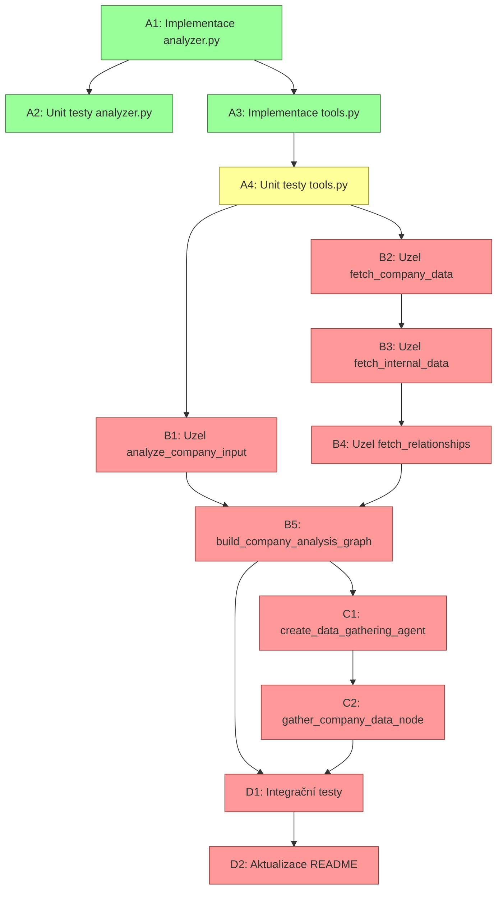

# Memory Agent PoC - Technický plán implementace
> Poslední aktualizace: 2025-04-16

## AKTUÁLNÍ PRIORITA
**Dokončit krok A4 - Unit testy pro tools.py**

### Specifikace kroku A4:
- Implementace mocků pro HTTP volání v testech
- ✅ Test pro SayariApiTool._arun (úspěšný scénář)
- ✅ Test pro SayariApiTool._arun (chybový scénář)
- ✅ Test pro SupabaseInternalDataTool._arun (úspěšný scénář)
- ✅ Test pro SupabaseInternalDataTool._arun (chybový scénář)
- ⏳ Test pro SayariRelationshipsTool._arun s úspěšnou odpovědí
- ⏳ Test pro SayariRelationshipsTool._arun s prázdným ID
- ⏳ Test pro upsert_memory s úspěšným uložením
- ⏳ Test pro upsert_memory s chybou
- ⏳ Ověření testovacích případů spuštěním `make test TEST_FILE=tests/unit_tests/test_tools.py`


## 1. STRUKTURA ŘEŠENÍ

### 1.1 Klíčové komponenty
- `analyzer.py`: Rozpoznání záměru a analýza dotazu
- `tools.py`: Nástroje pro přístup k API (Sayari, interní data) 
- `state.py`: Definice typů pro stavový graf
- `graph.py`: Hlavní LangGraph workflow s definicí grafu
- `hybrid_workflow.py`: Rozšíření s React agentem pro komplexní scénáře

### 1.2 Datové struktury

#### State (state.py)
```python
class State(TypedDict):
    """Stav workflow pro analýzu společností."""
    messages: List[BaseMessage]  # Zprávy v konverzaci
    company_analysis: Optional[AnalysisResult]  # Výsledek analýzy dotazu
    company_data: Dict[str, Any]  # Externí data o společnostech (klíč: jméno společnosti)
    internal_data: Dict[str, Any]  # Interní data o společnostech
    relationships_data: Dict[str, Any]  # Data o vztazích společností
    output: Optional[str]  # Finální výstup pro uživatele
    errors: List[str]  # Seznam chyb během zpracování
```

#### AnalysisResult (analyzer.py)
```python
class AnalysisResult(TypedDict):
    """Výsledek analýzy uživatelského dotazu."""
    companies: List[str]  # Seznam identifikovaných společností
    company: str  # Primární společnost (první v seznamu)
    analysis_type: Literal["risk_comparison", "common_suppliers", "general"]
    query: str  # Původní dotaz uživatele
    is_company_analysis: bool  # Indikuje, zda se jedná o analýzu společnosti
    confidence: float  # Míra jistoty analýzy (0.0 - 1.0)
```

#### Nástroje (tools.py)
```python
class SayariApiTool(BaseTool):
    """Nástroj pro volání Sayari API."""
    name: str = "sayari_api_tool"
    description: str = "Získává informace o společnosti z Sayari API"
    base_url: ClassVar[str] = "https://zyjgjpdwpdgfrpilxvvg.supabase.co/functions/v1/sayari-simulator"
    
    async def _arun(self, company_name: str) -> Dict[str, Any]:
        """Asynchronní volání Sayari API."""
        ...

class SupabaseInternalDataTool(BaseTool):
    """Nástroj pro získání interních dat o společnosti."""
    name: str = "supabase_internal_data_tool"
    description: str = "Získává interní data o společnosti včetně tier klasifikace a HS kódů"
    base_url: ClassVar[str] = "https://zyjgjpdwpdgfrpilxvvg.supabase.co/functions/v1/get-supplier-data"
    ...

class SayariRelationshipsTool(BaseTool):
    """Nástroj pro získání vztahů entity z Sayari API."""
    name: str = "sayari_relationships_tool" 
    description: str = "Získává vztahy entity (společnosti) z Sayari API"
    ...
```

#### React Agent Node (hybrid_workflow.py)
```python
async def gather_company_data_node(state: State, config: Dict[str, Any]) -> Dict:
    """Uzel, který orchestruje získávání dat o společnostech pomocí React agenta."""
    ...
```

## 2. IMPLEMENTAČNÍ KROKY

### Krok A: Základní komponenty
- [x] A1: `analyzer.py` - Implementace analyzátoru
- [x] A2: Unit testy pro `analyzer.py`
- [x] A3: `tools.py` - Implementace nástrojů pro API
- [ ] A4: Unit testy pro `tools.py` (50% hotovo)
  - [x] Test pro `SayariApiTool._arun` s úspěšnou odpovědí
  - [x] Test pro `SayariApiTool._arun` s chybovou odpovědí
  - [x] Test pro `SupabaseInternalDataTool._arun` s úspěšnou odpovědí
  - [x] Test pro `SupabaseInternalDataTool._arun` s chybovou odpovědí
  - [ ] Test pro `SayariRelationshipsTool._arun` s úspěšnou odpovědí
  - [ ] Test pro `SayariRelationshipsTool._arun` s prázdným ID
  - [ ] Test pro `upsert_memory` s úspěšným uložením
  - [ ] Test pro `upsert_memory` s chybou

### Krok B: LangGraph workflow (BLOKOVÁNO krokem A4)
- [ ] B1: `graph.py:analyze_company_input` - Uzel pro analýzu vstupu
  - [ ] Implementace funkce přijímající State
  - [ ] Volání analyze_query z analyzer.py
  - [ ] Správné aktualizace stavu
  - [ ] Ošetření chyb
- [ ] B2: `graph.py:fetch_company_data` - Uzel pro získání dat o firmě 
  - [ ] Implementace volání SayariApiTool
  - [ ] Zpracování výsledků do stavu
- [ ] B3: `graph.py:fetch_internal_data` - Uzel pro interní data
  - [ ] Implementace volání SupabaseInternalDataTool
  - [ ] Zpracování výsledků do stavu
- [ ] B4: `graph.py:fetch_relationships` - Uzel pro vztahy
  - [ ] Implementace volání SayariRelationshipsTool
  - [ ] Zpracování výsledků do stavu
- [ ] B5: `graph.py:build_company_analysis_graph` - Definice grafu
  - [ ] Definice uzlů grafu
  - [ ] Definice podmíněných přechodů
  - [ ] Routovací funkce pro větvení grafu

### Krok C: Hybridní workflow s React agentem (BLOKOVÁNO krokem B)
- [ ] C1: `hybrid_workflow.py:create_data_gathering_agent` - Agent pro sběr dat
  - [ ] Implementace @tool funkcí pro nástroje
  - [ ] Sestavení React agenta pomocí create_react_agent
  - [ ] Tvorba systémového promptu pro agenta
- [ ] C2: `hybrid_workflow.py:gather_company_data_node` - Uzel pro multi-company analýzu
  - [ ] Implementace uzlu pro LangGraph
  - [ ] Logika pro iteraci přes více společností
  - [ ] Zpracování výsledků agenta

### Krok D: Testování a dokončení (BLOKOVÁNO kroky B a C)
- [ ] D1: Integrační testy - End-to-end testy workflow
  - [ ] Test pro jednotlivé kroky grafu s mocky
  - [ ] Test pro celý workflow s různými vstupními dotazy
  - [ ] Test pro React agenta zpracovávajícího více společností
- [ ] D2: Aktualizace README - Dokumentace
  - [ ] Popis instalace a spuštění
  - [ ] Popis architektury a workflow
  - [ ] Příklady použití


## 3. GRAF ZÁVISLOSTÍ



## 4. PRAVIDLA POSTUPU
1. Každý krok má jasně definované výstupy a testovací požadavky
2. Nelze přejít na následující krok, dokud nejsou současné kroky DOKONČENY
3. Status DOKONČENO může být přidělen pouze když:
   - Všechny položky v checklistu jsou označeny
   - Všechny testy prochází
   - Code review bylo provedeno

## 5. NÁSLEDUJÍCÍ KONKRÉTNÍ ÚKOLY

1. **Dokončit testy pro SayariRelationshipsTool v test_tools.py**
   - Vytvořit test pro úspěšné volání `_arun` s validním ID
   - Vytvořit test pro volání `_arun` s prázdným ID
   - Ověřit správné zpracování výsledných dat

2. **Implementovat testy pro upsert_memory funkci**
   - Připravit mock objekty pro BaseStore a Configuration
   - Vytvořit test pro úspěšné uložení paměti
   - Vytvořit test pro zpracování chyby při ukládání
   - Otestovat automatické generování UUID
   - Otestovat zpracování chyby při extrakci user_id

3. **Spustit a validovat všechny testy**
   - Spustit pomocí `make test TEST_FILE=tests/unit_tests/test_tools.py`
   - Ověřit, že všechny testy prochází
   - Zkontrolovat pokrytí kódu testy