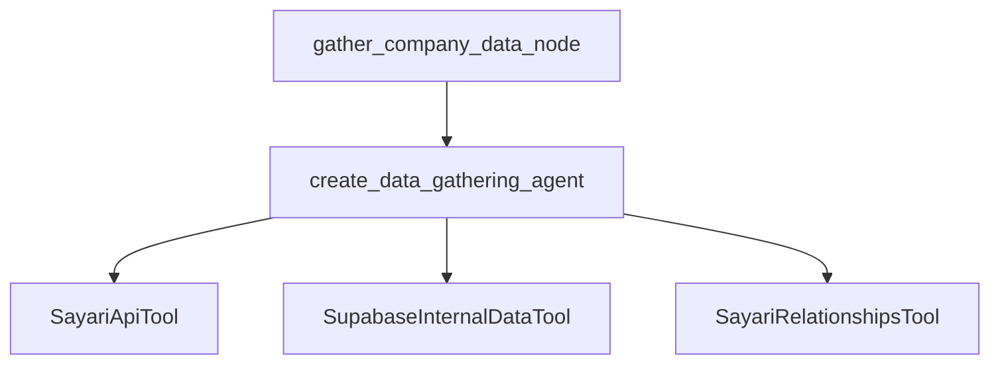

<!-- filepath: /Users/marekminarovic/claude-code/memory-agent/docs/react_agent.md -->
# React Agent v Memory Agent projektu

Tento dokument popisuje implementaci React agenta, který je používán v Memory Agent projektu pro komplexní zpracování dat o společnostech.

## Přehled React agenta

React agent je součástí hybridní architektury Memory Agenta a je zodpovědný za komplexní rozhodování při zpracování dat o více společnostech. Využívá LangGraph prebuilt komponentu `create_react_agent` a implementuje specializované nástroje pro interakci s externími API.

Hybridní architekturu Memory Agent jsme navrhli s cílem maximalizovat výhody obou přístupů:

1. **LangGraph** pro celkový workflow a zajištění stavovosti
2. **React agent** pro komplexní rozhodování při zpracování dat o více společnostech

Toto řešení bylo implementováno v souboru `src/memory_agent/hybrid_workflow.py`.

## Architektura



## Implementační detaily

### 1. Definice stavu grafu

```python
class State(TypedDict):
    """Stav workflow pro analýzu společností."""
    
    # Vstup, analýza a zpracování
    messages: List[BaseMessage]  # Zprávy v konverzaci
    company_analysis: Optional[AnalysisResult]  # Výsledek analýzy dotazu
    
    # Data o společnostech
    company_data: Dict[str, Any]  # Externí data o společnostech (klíč: jméno společnosti)
    internal_data: Dict[str, Any]  # Interní data o společnostech
    relationships_data: Dict[str, Any]  # Data o vztazích společností
    
    # Výstup
    output: Optional[str]  # Finální výstup pro uživatele
    errors: List[str]  # Seznam chyb během zpracování
```

### 2. Nástroje pro React agenta

```python
@tool
async def fetch_company_data(company: str) -> str:
    """Získá data o společnosti z externího API."""
    try:
        sayari_tool = SayariApiTool()
        result = await sayari_tool._arun(company)
        return f"Úspěšně získána data o společnosti {company}. Entity ID: {result.get('id', 'N/A')}"
    except Exception as e:
        return f"Chyba při získávání dat o společnosti {company}: {str(e)}"

@tool
async def fetch_internal_data(company: str) -> str:
    """Získá interní data o společnosti."""
    try:
        internal_tool = SupabaseInternalDataTool()
        result = await internal_tool._arun(company)
        return f"Úspěšně získána interní data o společnosti {company}."
    except Exception as e:
        return f"Chyba při získávání interních dat o společnosti {company}: {str(e)}"

@tool
async def fetch_relationships(entity_id: str, company: str) -> str:
    """Získá data o vztazích společnosti."""
    try:
        relationships_tool = SayariRelationshipsTool()
        result = await relationships_tool._arun(entity_id)
        return f"Úspěšně získána data o vztazích pro společnost {company} (ID: {entity_id})."
    except Exception as e:
        return f"Chyba při získávání dat o vztazích pro společnost {company}: {str(e)}"
```

### 3. Vytvoření React agenta

```python
def create_data_gathering_agent(llm):
    """Vytvoří React agenta pro získávání dat o společnostech."""
    tools = [fetch_company_data, fetch_internal_data, fetch_relationships]
    
    system_prompt = """Jsi specializovaný agent pro získávání dat o společnostech. 
    
    Tvým úkolem je získat kompletní data pro všechny uvedené společnosti z dostupných zdrojů:

    1. Pro každou společnost nejprve získej základní externí data pomocí nástroje fetch_company_data
    2. Poté získej interní data pomocí nástroje fetch_internal_data 
    3. Pokud má společnost entity_id (uvedeno v odpovědi z fetch_company_data), získej také data o vztazích pomocí nástroje fetch_relationships

    Pokus se získat co nejvíce dat i v případě, že některé API volání selže. Postupuj systematicky a zkus alternativní způsoby získání dat, pokud je to možné.
    
    Přehledně seřaď výsledky podle společností a shrň, jaká data se podařilo/nepodařilo získat.
    """
    
    return create_react_agent(llm, tools, prompt=system_prompt)
```

### 4. Implementace uzlu s React agentem

```python
async def gather_company_data_node(state: State, config: Dict[str, Any]) -> Dict:
    """Uzel, který orchestruje získávání dat o společnostech pomocí React agenta."""
    analysis = state.get("company_analysis", {})
    companies = analysis.get("companies", [])
    
    if not companies:
        return {
            "company_data": {},
            "internal_data": {},
            "relationships_data": {}
        }
    
    try:
        # Inicializace LLM pro React agenta
        llm = init_chat_model()
        
        # Vytvoření React agenta
        agent = create_data_gathering_agent(llm)
        
        # Vytvoření prompta pro agenta s seznamem společností
        company_list = ", ".join(companies)
        
        # Zavolání React agenta
        agent_result = await agent.ainvoke({
            "messages": [
                HumanMessage(content=f"Získej data pro tyto společnosti: {company_list}")
            ]
        })
        
        # Zde by následovala logika zpracování výsledků agenta a jejich převod do strukturovaných dat
        
        # Pro ukázku používáme zjednodušený přístup vrácení ukázkových dat
        # V produkční implementaci by zde byla komplexnější logika extrakce dat
        
        return {
            "company_data": {...},  # Strukturovaná data o společnostech
            "internal_data": {...},  # Interní data
            "relationships_data": {...}  # Data o vztazích
        }
    except Exception as e:
        logger.error(f"Chyba při získávání dat o společnostech: {str(e)}")
        return {
            "errors": state.get("errors", []) + [f"Chyba při získávání dat: {str(e)}"]
        }
```

### 5. Definice grafu s React agentem

```python
def create_analysis_graph():
    """Vytvoří graf workflow pro analýzu společností."""
    # Vytvoření stavového grafu
    builder = StateGraph(State)
    
    # Přidání uzlů grafu
    builder.add_node("analyze_company_input", analyze_company_input)
    builder.add_node("gather_company_data", gather_company_data_node)  # Uzel s React agentem
    builder.add_node("call_model", call_model)
    
    # Definice hran
    builder.add_edge("analyze_company_input", "gather_company_data")
    builder.add_edge("gather_company_data", "call_model")
    builder.add_edge("call_model", END)
    
    # Definice routeru pro podmíněné větvení
    def route_after_analysis(state: State):
        """Rozhoduje o dalším kroku na základě výsledku analýzy."""
        analysis = state.get("company_analysis", {})
        
        # Pokud nemáme společnosti k analýze, můžeme přeskočit sběr dat
        if not analysis.get("companies") or not analysis.get("is_company_analysis", False):
            return "call_model"
        
        return "gather_company_data"
    
    # Přidání podmíněného větvení
    builder.add_conditional_edges(
        "analyze_company_input",
        route_after_analysis,
        {
            "gather_company_data": "gather_company_data",
            "call_model": "call_model"
        }
    )
    
    # Kompilace grafu
    return builder.compile()
```

## Fungování React agenta

React agent pracuje podle principu "ReAct" (Reasoning and Acting):

1. **Reasoning (Uvažování)** - LLM nejprve přemýšlí o problému, analyzuje ho a určuje další kroky
2. **Acting (Akce)** - Agent provede akci pomocí dostupných nástrojů
3. **Observation (Pozorování)** - Agent zaregistruje výsledky akce
4. **Opakování cyklu** - Agent znovu uvažuje, provádí další akce a pozoruje výsledky

### Klíčové výhody React agenta v našem workflow

1. **Autonomní rozhodování** - Agent sám určuje, jaké nástroje a v jakém pořadí použít
2. **Odolnost vůči chybám** - Dokáže reagovat na selhání API a hledat alternativní postupy
3. **Flexibilita** - Může pracovat s různým počtem společností a různými scénáři
4. **Čitelné uvažování** - Agent vysvětluje své rozhodování, což usnadňuje ladění a auditing

## Integrace s LangGraph workflow

React agent je integrován do celkového LangGraph workflow jako specializovaný uzel, který je aktivován na základě typu analýzy detekovaného v `analyze_company_input` uzlu. React agent v našem workflow:

- Přijímá seznam společností k analýze (z `company_analysis`)
- Vrací strukturovaná data o společnostech (`company_data`), interní data (`internal_data`) a data o vztazích (`relationships_data`)

## Testování React agenta

Pro testování React agenta v rámci workflow je vhodné:

1. **Vytvořit mock objekty** pro nástroje, aby agent pracoval s konstantními daty
2. **Testovat různé scénáře** - jedna společnost, více společností, neexistující společnost, chyba API
3. **Validovat strukturu výstupních dat** - ověřit, že agent správně strukturuje získaná data
4. **Měřit čas zpracování** - pro optimalizaci výkonu

## Praktický příklad použití

```python
async def main():
    # Vytvoření grafu
    graph = create_analysis_graph()
    
    # Zpracování dotazu s více společnostmi
    query = "Porovnej rizika společností Apple a Samsung"
    initial_state = {
        "messages": [HumanMessage(content=query)],
        "company_analysis": None,
        "company_data": {},
        "internal_data": {},
        "relationships_data": {},
        "output": None,
        "errors": []
    }
    
    # Spuštění workflow
    result = await graph.ainvoke(initial_state)
    
    # Výsledek obsahuje data získaná React agentem a finální odpověď
    return result.get("output")
```

## Závěr

Implementace React agenta v rámci LangGraph workflow představuje efektivní řešení pro komplexní zpracování dat o více společnostech. Tento hybridní přístup kombinuje výhody obou technologií - stavovost a strukturovanost LangGraph s inteligentním rozhodováním a flexibilitou React agenta.
